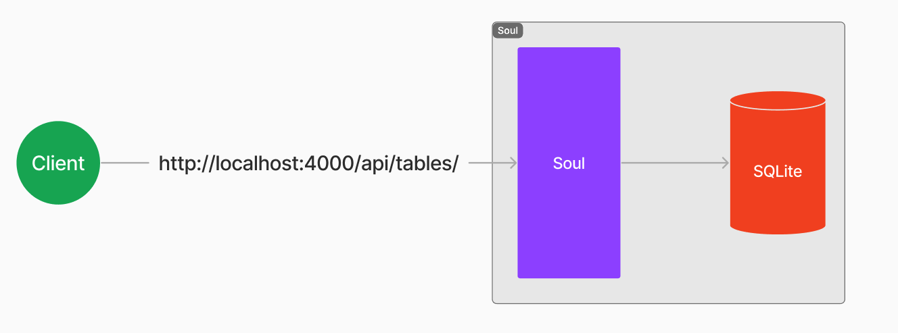
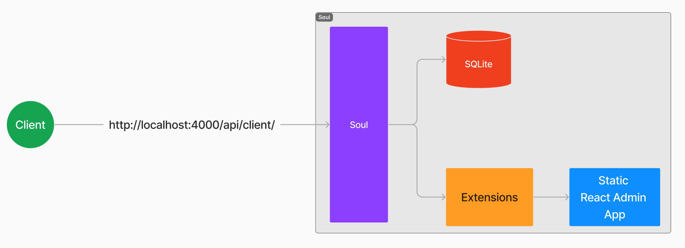

# Hosting Static Content Using Soul

You can host static content using Soul by utilizing its extensions feature. This allows you to expose your static application through Soul, enabling users to access your content without hosting multiple applications.

Here are diagrams showing how to access Soul APIs when running standalone and how to expose a static client via extensions.

**Accessing Soul APIs**


**Accessing a React Admin Application via Soul**


## Steps

In this guide, we will demonstrate how to host a static `React Admin` application.

1. Create an `_extensions` folder and add an `api.js` file to it.:
   ```sh
     mkdir _extensions && touch _extensions/api.js
   ```
2. Add the following code to the `api.js` file:

   ```js
   const reactAdminApp = {
     method: "GET",
     path: "/api/client",
     handler: (req, res, db) => {
       const clientPath = path.join(__dirname, "../dist", "index.html");
       res.app.use(express.static(path.join(__dirname, "../dist")));
       res.sendFile(clientPath);
     },
   };
   ```

3. Build your React Admin client:

   ```sh
      npm run build
   ```

4. Copy the `dist` folder from your `React Admin` project to the `_extensions` folder:

   ```sh
    cp -r dist <path/to/_extensions>
   ```

5. Run your Soul application:
   ```sh
    soul -d foobar.db --extensions /path/to/_extensions/
   ```
6. To verify that the app is working, open the following URL in your browser:
   ```
    http://localhost:<port>/api/client
   ```
